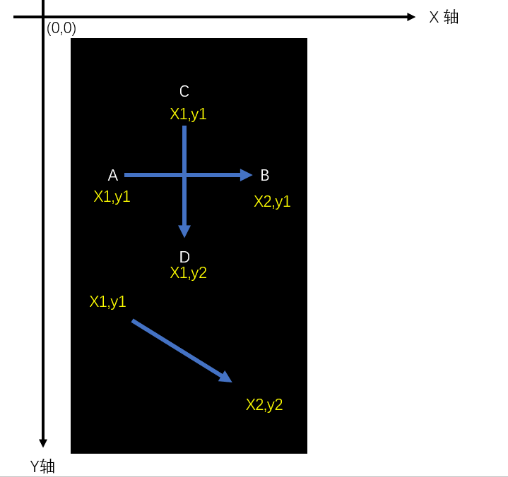

应用背景
--------

在app应用日常使用过程中，会经常用到在屏幕滑动操作。如刷朋友圈上下滑操作、浏览图片左右滑动操作等。在自动化脚本该如何实现这些操作呢？

在Appium中模拟用户滑动操作需要使用swipe方法，该方法定义如下：

def swipe(self, start\_x, start\_y, end\_x, end\_y, duration=None):

\"\"\"Swipe from one point to another point, for an optional duration.

:Args:

\- start\_x - x-coordinate at which to **start**

\- start\_y - y-coordinate **at** which **to** **start**

\- end\_x - x-coordinate **at** which **to** **stop**

\- end\_y - y-coordinate **at** which **to** **stop**

\- **duration** - (optional) **time** **to** take the swipe, **in** ms.

:**Usage**:

driver.swipe(100, 100, 100, 400)

滑动解析
--------

滑动主要分为：

1.  水平滑动

2.  垂直滑动

3.  任意方向滑动

滑动轨迹图如下：

实践应用
--------

#### 测试场景

-   安装启动考研帮，手动向水平左滑动首页引导页面。

-   点击"立即体验"进入登录页面。

#### 代码实现

[[swipe.py]{.underline}](http://swipe.py)

**from** time **import** sleep

**from** find\_element.capability **import** driver

*\#获取屏幕尺寸*

**def** **get\_size**():

x=driver.get\_window\_size()\[\'width\'\]

y=driver.get\_window\_size()\[\'height\'\]

**return** x,y

*\#显示屏幕尺寸（width,height）*

l=get\_size()

print(l)

*\#向左滑动*

**def** **swipeLeft**():

l=get\_size()

x1=int(l\[0\]\*0.9)

y1=int(l\[1\]\*0.5)

x2=int(l\[0\]\*0.1)

driver.swipe(x1,y1,x2,y1,1000)

*\#向左滑动2次*

**for** i **in** range(2):

swipeLeft()

sleep(0.5)

driver.find\_element\_by\_id(\'com.tal.kaoyan:id/activity\_splash\_guidfinish\').click()

注意：运行前记得将capablity里面的check\_skipBtn()先注释掉，否则直接跳过了无法滑动引导页面。

课后作业
--------

把垂直上下滑动以及向右滑动的也封装并实践。

-   def swipeUp()

-   def swipeDown()

-   def swipeRight()

#### 参考答案

def **swipeUp**():

l = get\_size()

x1 = **int**(l\[0\] \* 0.5)

y1 = **int**(l\[1\] \* 0.95)

y2 = **int**(l\[1\] \* 0.35)

driver.swipe(x1, y1, x1, y2, 1000)

def **swipeDown**():

l=get\_size()

x1 = **int**(l\[0\] \* 0.5)

y1 = **int**(l\[1\] \* 0.35)

y2 = **int**(l\[1\] \* 0.85)

driver.swipe(x1, y1, x1, y2, 1000)

def **swipeRight**():

l=get\_size()

y1 = **int**(l\[1\] \* 0.5)

x1 = **int**(l\[0\] \* 0.25)

x2 = **int**(l\[0\] \* 0.95)

driver.swipe(x1, y1, x2, y1, 1000)
